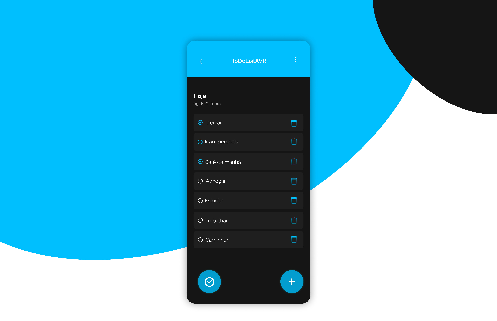

<h1>TO DO LIST AVR 📝✅</h1>

 
    <h1>SOBRE O APP 🚀</h1>  
   Vamos desenvolver um Aplicativo Mobile To Do List, onde o usuário poderá colocar suas tarefas diárias para manter-se organizado e produtivo em sua vida agitada. 
    Este aplicativo de lista de tarefas intuitivo é projetado para simplificar sua rotina diária, ajudando-o a gerenciar suas tarefas de forma eficiente. 
  O Usuário poderá adicionar tarefas, excluir tarefas, marcar tarefas como concluída e visualizar as tarefas concluídas.

 
     <h1>PROTÓTIPO 📱</h1>
    

  
    

  

 <a href="https://www.figma.com/proto/pYiA8ogBZIscLLjrYe7d92/ToDoList?type=design&node-id=5-17&t=Nx6CY1ORbEWoUksS-0&scaling=scale-down&page-id=0%3A1&starting-point-node-id=5%3A17">Link Do Protótipo</a>
 

    

    <h1>FUNCIONALIDADES 😎</h1>
    
  <li>Criar Tarefas</li>
  <li>Excluir Tarefas</li>
  <li>Marcar Tarefas como Concluídas</li>
  <li>Visualizar Tarefas Concluídas</li>

